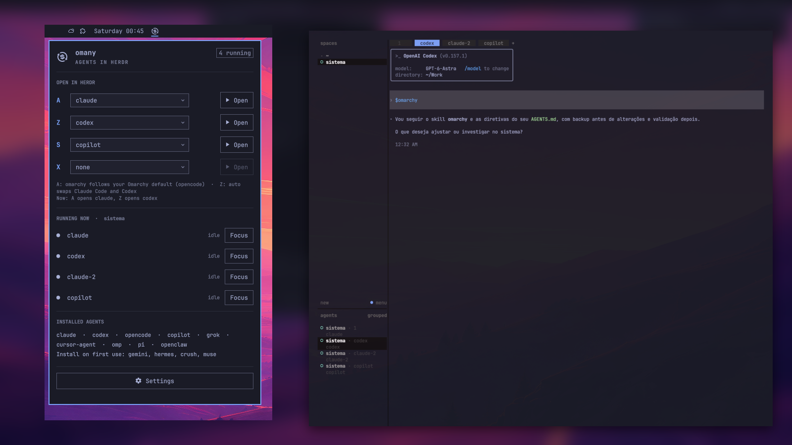

# omonorepo

**O normatizador dos plugins do Omarchy: diz ao usuário o que ele já tem, o que
conflita e do que cada coisa depende.**

## Por que existimos

O marketplace do Omarchy tem milhares de plugins (4.178 em 26/09/2026) e muitos fazem
a mesma coisa: 228 tratam de agentes de IA, 242 de bateria e energia, 172 de relógio,
calendário e clima.

O marketplace valida **cada plugin isolado**. Ninguém valida **a relação entre eles**.
Quem instala só descobre no uso que:

- já tinha outro plugin fazendo o mesmo;
- dois plugins disputam a mesma tecla, o mesmo lugar na barra ou o mesmo arquivo de
  configuração;
- um plugin dependia de algo que não estava lá.

## O que resolvemos

Antes e depois de instalar, o omonorepo responde:

1. **Eu já tenho isso?** Sobreposição com o que está instalado.
2. **Isso conflita com algo?** Teclas, IPC, barra, arquivos de configuração.
3. **Do que isso depende?** Ferramentas, agentes, outros plugins.

Para quem **escreve** plugins, ele reúne as regras do Omarchy, do marketplace e as
nossas de estabilidade, e confere cada plugin da série antes de publicar. Para quem
**usa**, ele mapeia o que está instalado e propõe uma configuração coerente.

Começamos pelos **agentes**, a família com menos uniformidade hoje: cada ferramenta
abre o agente de um jeito, os plugins do Herdr só observam, e os instaladores trocam o
agente padrão sem avisar. O detalhe está em [PRODUTO.md](PRODUTO.md).

## A série

Cada plugin tem repositório próprio (o marketplace exige o `manifest.json` na raiz) e
entra aqui como submódulo, com sua documentação e homologação.

| Plugin | O que faz | Repositório |
|---|---|---|
| **omany** (1º da série) | Uniformiza os agentes: todos abrem no Herdr, uma aba por agente, quatro vagas previsíveis e o skill do Omarchy no primeiro turno | [aiob3/omany](https://github.com/aiob3/omany) |
| **omaplug** | Gerenciador de plugins do Omarchy (nosso fork); onde o usuário vê conflitos de tecla e, em seguida, entre plugins ativos | [aiob3/omaplug](https://github.com/aiob3/omaplug) |

### omany em uma imagem



| Tecla | Abre |
|---|---|
| Super+Ctrl+Shift+A | o agente padrão (Claude Code) |
| Super+Ctrl+Shift+Z | o outro (Codex) |
| Super+Ctrl+Shift+S / X | vagas livres, escolhidas no painel |

A homologação, feita no uso real em 25 e 26/09/2026, está em
[docs/omany/homologacao](docs/omany/homologacao/README.md).

## Como clonar

```bash
git clone --recurse-submodules https://github.com/aiob3/omonorepo.git
```
