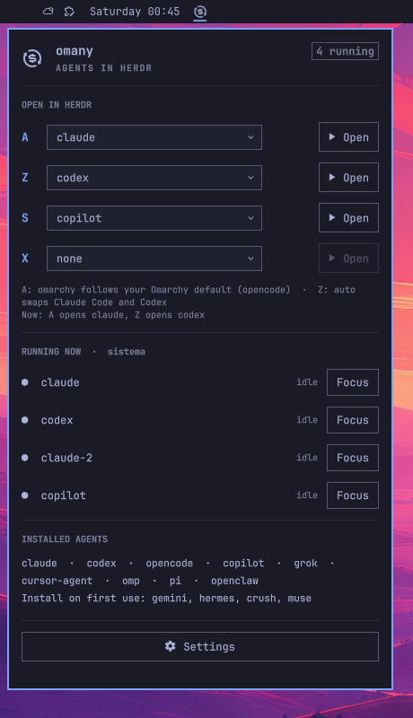
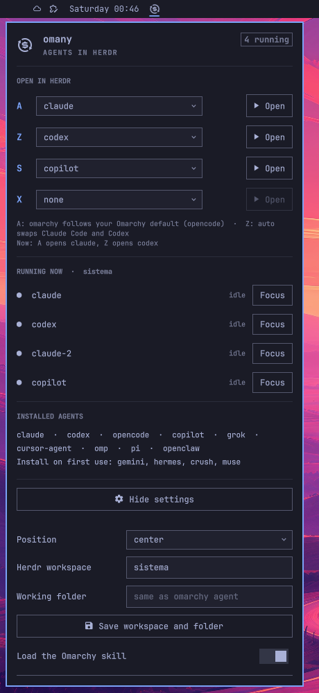

# omany acceptance record

Done in real use on 2026-09-25 and 26, on an Omarchy workstation with Hyprland 0.56,
Herdr 0.8.2, Claude Code 2.1.283 and Codex 0.157. Test rule: the operator presses the
key or clicks, and the assistant confirms through the log (`~/.local/state/omany.log`)
and Herdr's state. No automated tests.

## What was accepted

| Feature | Result |
|---|---|
| Super+Ctrl+Shift+A opens the default agent in Herdr, a new tab per press, a single window | accepted |
| Super+Ctrl+Shift+Z opens the other agent (Claude Code ↔ Codex) | accepted |
| Super+Ctrl+Shift+S / X open the agents picked for the slots | accepted (Copilot, Grok) |
| An empty slot warns and opens nothing | accepted |
| Omarchy skill on the first turn (`/omarchy` in Claude Code, `$omarchy` in Codex) | accepted |
| Bar icon, right after the clock | accepted |
| Panel: slots with a picker, Open, running agents with Focus, installed agents | accepted |
| Settings: position, workspace, folder with Save, skill | accepted |
| Reset to a fresh install, confirmed with two clicks | accepted |

## Keys

Every Super+Ctrl+Shift letter was pressed on 2026-09-26. Only omany's keys answered
(A, Z, S, X, and C bound to Copilot); the other free letters did nothing, except P:
Hyprland does not catch it, so the focused agent received it as Ctrl+P and recalled
the previous prompt. Super+Ctrl+Shift+G, used in an early README example, also opened
Google Messages (an Omarchy default); the example moved to C and O, and rule K1 now
catches that kind of conflict.

## Agents

| Agent | Launches logged | Status |
|---|---|---|
| Claude Code | 24 | accepted, Omarchy skill loaded |
| Codex | 13 | accepted, Omarchy skill loaded |
| GitHub Copilot CLI | 9 | accepted |
| Grok | 1 | accepted (unnamed-on-retry fixed in 0.9.0) |
| OpenCode | 3 | opens; OpenCode itself stopped during its own startup (outside omany) |
| LionTUI (LionLabs community) | 1 | accepted as a plain command; see docs/integrations/liontui.md |
| agy (Antigravity) | 1 | accepted as a plain command, on 0.12.0; see the section below |
| Gemini, Cursor Agent, Hermes, OMP, Pi, OpenClaw, Crush, Muse | 0 | supported, not tested yet |

## 0.12.0 — agy (Antigravity), the first outside contribution

Done in real use on 2026-09-27, on the same workstation, by then running Hyprland
0.56.2, Herdr 0.9.1 and agy 1.2.11 installed through mise
(`aqua:google-antigravity/antigravity-cli`). Same test rule: the operator clicks and
presses the key, the assistant confirms through the log and Herdr's state.

agy arrived through pull request #1, from an outside contributor, who reported having
tested it. This record is our own run, not theirs.

| Step | Result |
|---|---|
| agy appears in all four slot pickers in the panel | accepted (4 of 4) |
| `omany-state` reports agy as `installed`, without running the binary | accepted |
| Slot X set to agy through the panel | accepted |
| Super+Ctrl+Shift+X opens agy in a Herdr tab, as a plain command | accepted |
| The panel lists the running agy with Focus | accepted (one pane, idle) |

The log for the accepted launch:

```
agent=agy kind=plain ws=<workspace> tab=<workspace>:t5 pane=<workspace>:p5
ok: agy in <workspace>:p5 (plain command: agy)
```

### Found here: a saved slot can outlive the agent it names

Before the slot was changed, Super+Ctrl+Shift+X still carried `lion`, saved while an
earlier version offered it. 0.11.2 had removed that agent, so the key answered
`ERROR: omany does not know how to start lion` and opened nothing.

The behaviour is correct (a clear message in the log, no crash, nothing launched), and
it is worth stating: removing an agent from the manifest does not clear a slot a user
already saved, and the user only finds out when the key is pressed. Whoever drops an
agent from a future version should say so in the release notes.

## Problems found and fixed along the way

- **Loose window:** Omarchy's original key opened the agent outside Herdr.
- **Codex Enter:** `$` opens the skill menu, and the first Enter only picks the item.
- **Cold start:** with the Herdr server stopped, the window must open before any command.
- **Invisible icon:** without `implicitWidth` the widget had zero width on the bar.
- **"File name case mismatch":** Qt's directory cache; `omarchy restart shell` clears it.
- **Plugin "enabled" but no icon:** a leftover `plugins[]` entry in `shell.json`.
- **Agents Herdr cannot recognize** (OpenClaw, Crush, Muse): they open as a plain command in a tab.
- **First-run installer stubs:** some agents install on first run; the panel reads the file and never runs it.
- **Unnamed Grok:** a retry found the agent already running; now it only gets its name.
- **Omarchy's default-agent bias:** installing an agent from the menu makes it the default; omany's slot A can stay independent.

## Screenshots

| Preview | Panel | Settings | Herdr |
|---|---|---|---|
|  |  |  |  |
